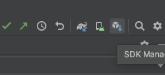
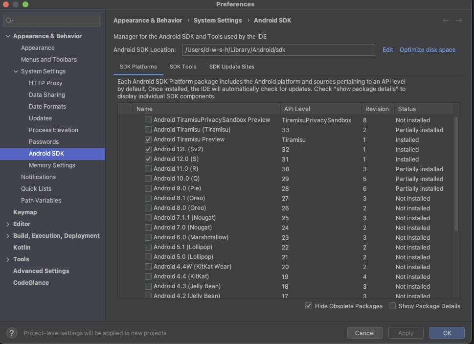
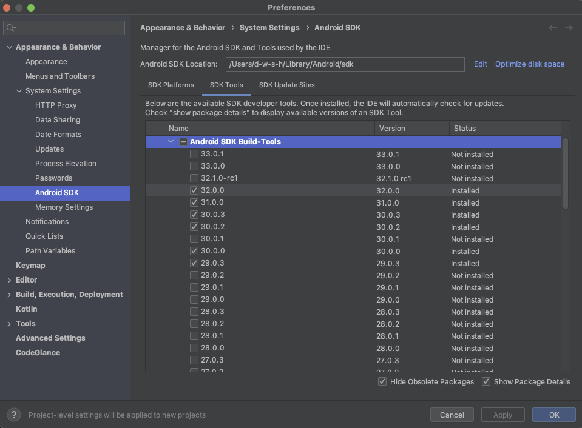
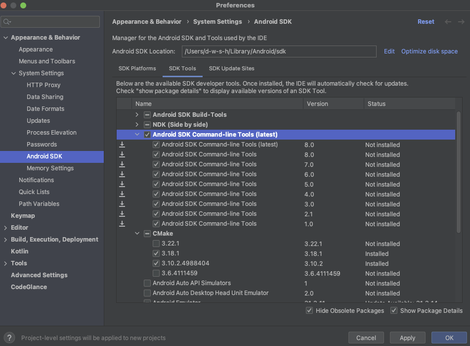
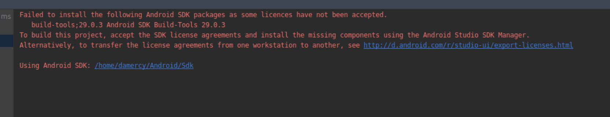
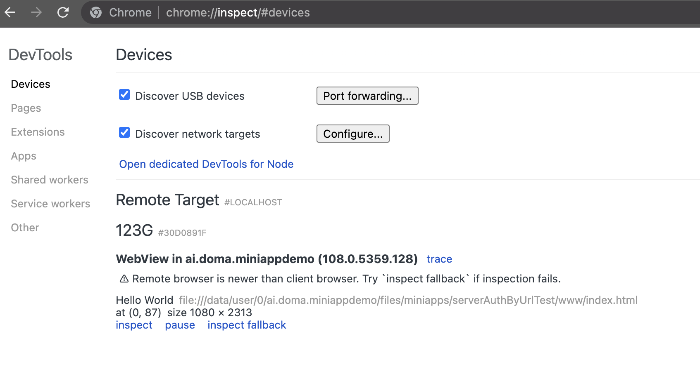
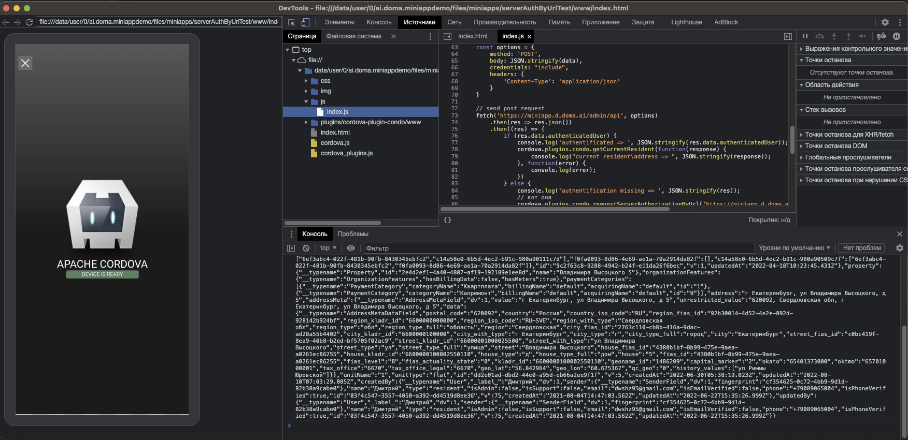

# Hello

This is a Condo Miniapps playground for Android, it is still under development, but already allows you to feel the real process of interaction with the application.

You can find the cordova app itself in the `MainCordovaApplication` folder, where in the www folder there is an example of interaction with the native api and you can develop something of your own.


# Important! Known issues.
1. only version 10 of Cordova is currently supported


# Content
1. [Getting started](#getting_started)
2. [Common methods.](#common_methods)
3. [Important differences.](#important_differences)
4. [Testing.](#testing)

   4.1 [Testing in Demo environment](#testing-demo)

   4.2 [Testing in Production environment](#testing-production)
5. [Publishing.](#publishing)


# Getting started <a name="getting_started"></a>

1. Installing the necessary dependencies:

- make sure you have the latest version of Android Studio [installed](https://developer.android.com/studio/install)

- [install](https://github.com/nvm-sh/nvm#installing-and-updating) nvm, node and npm 

- cordova installation:

        npm install -g cordova
- open Android Studio, choose project folder to open, then open sdk manager



- project is running under android 12 (api level 32), install required dependenies





2. Editing the application

- open the project directory and go to the `/MainCordovaApplication/www` subdirectory

  it will contain your application code, edit it freely

3. Launching and testing the application
- ⚠️Android app works with miniapps builds for the iOS environment from `MainCordovaApplication/platforms/ios`.

- For linux and macOS: there is `updateCordovaProjectToDemo` subtask which runs during project build (file `app/build.gradle`, 66 line), this subtask automatically builds final cordova app file `www.zip` (`MainCordovaApplication/platforms/ios/www.zip`) and copies it into `app/src/main/res/raw/www.zip` to use it by android app.
- For Windows: before each app build run these scripts:
        
        cd MainCordovaApplication
        cordova prepare ios
        tar -a -c -f www.zip www
        copy /y  www.zip ..\..\..\app\src\main\res\raw\www.zip

- open project folder with Android Studio, wait until indexing is complete, then choose real or virtual device and click play button


- if you have this error



accept license agreements by:

        cd ~/Library/Android/sdk/tools/bin/
        ./sdkmanager --licenses


# Common methods <a name="common_methods"></a>
- authorization


`function requestServerAuthorizationByUrl(miniapp_server_init_auth_url, custom_params_reserver_for_future_use, success, error)`

example:

```javascript  
        cordova.plugins.condo.requestServerAuthorizationByUrl('https://miniapp.d.doma.ai/oidc/auth', {}, function(response) {
            console.log('recive authorication result => ', JSON.stringify(response));
            window.location.reload();
        }, function(error) {
            console.log(error);
        });
```

- obtaining a current resident/address

`function getCurrentResident(success, error)`

  example:
```javascript  
        cordova.plugins.condo.getCurrentResident(function(response) {
            console.log("current resident\address => ", JSON.stringify(response));
        }, function(error) {
            console.log(error);
        });
```


- application closing

`function closeApplication(success, error)`

  example:
```javascript  
        cordova.plugins.condo.closeApplication(function(response) {}, function(error) {});
```


# Important differences. <a name="important_differences"></a>
Unlike the standard Cordova, our application uses an additional configuration file, which must be located in the www directory and named **native_config.json**

This file is a json file and may contain the following fields:

1. presentationStyle - application display type, required, should be set to **present_fullscreen**
2. mobile_permissions - An array of strings describing the necessary permissions for the application to work. the array can contain the following values: **record_audio**, **camera**, **audio_settings**


# Testing  <a name="testing"></a>

## Demo environment  <a name="testing-demo"></a>

1. Open Chrome and enter into url field `chrome://inspect/#devices`
Choose WebView in ai.doma.miniappdemo and click "inspect"

   

2. Yay! Standard Chrome debugging tools are connected to your mini-application

   

## Production environment  <a name="testing-production"></a>

1. Take `www.zip` archive built for ios environment:

        MainCordovaApplication/platforms/ios/www.zip

    If it doesn't exist create it from folder:

        /MainCordovaApplication/platforms/ios/www

2. [Install](https://play.google.com/store/apps/details?id=ai.doma.client) Doma app from Google Play

3. The app you downloaded has built-in functionality for debugging mini-applications. To turn it on & off, you can use these deeplinks from your phone:

- [Click here to switch on](https://mobile.doma.ai/api/mobile/partners/miniapps/enable-local.html)
- [Click here to switch off](https://mobile.doma.ai/api/mobile/partners/miniapps/disable-local.html)

5. Now, on the main application screen in the list of mini-applications, the last button allows you to download or replace a previously downloaded mini-application from files. When you click on it, you need to select the previously taken `www.zip` archive.

6. The application loaded in this way has a built-in js console, which is accessible by clicking on the button at the bottom right of the open mini-application and is able to show a lot of additional information, including various errors.


# Publishing <a name="publishing"></a>
To publish the mini-application, send the `www.zip` archive you received during the testing phase to the people at Doma with whom you interact.   
        